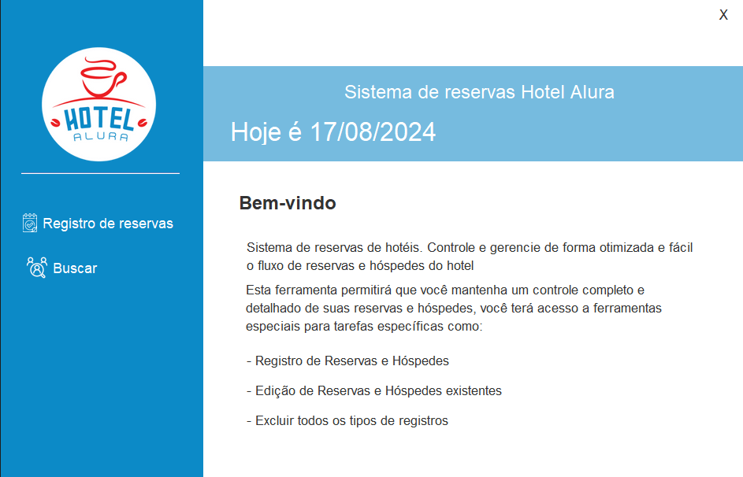
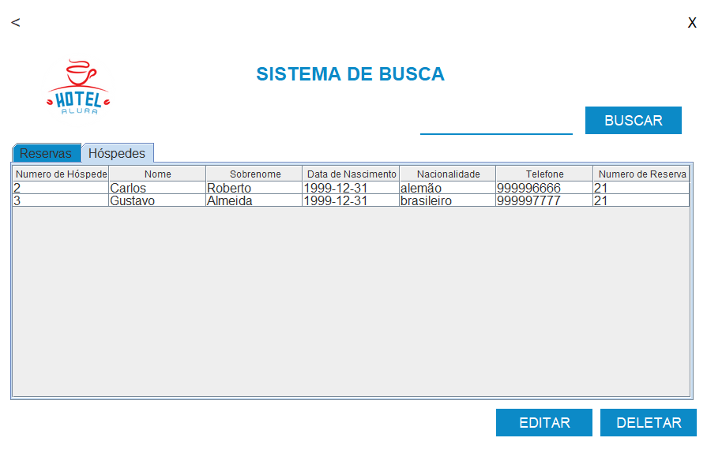

# Challenge ONE Hotel Alura

## Tecnologias Utilizadas:

- Java
- IntelliJ
- MySql
- Biblioteca JCalendar
- Plugin WindowBuilder  

## Com o Hotel Alura você faz:

- Registro de Reservas e Hóspedes
- Edição de Reservas e Hóspedes existentes
- Exclusão de todos os tipos de registros

## Para usar é preciso:

- Fazer o download do repositório
- Ter instalado o Java na versão 17 ou superior*
- Ter o MySQL e um Servidor Local instalado e configurado no computador
- Ter o <a href="https://github.com/gabrieszin/Alura-Hotel/blob/master/database/hotel_alura.sql">banco de dados</a>
- Executar o programa através da classe Main
- Os dados de login padrão são:  
  -<b>Usuário: </b>admin  
  -<b>Senha: </b>admin
